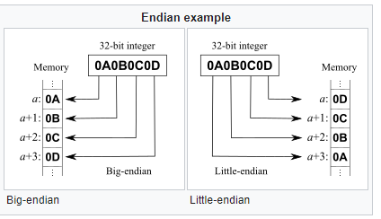
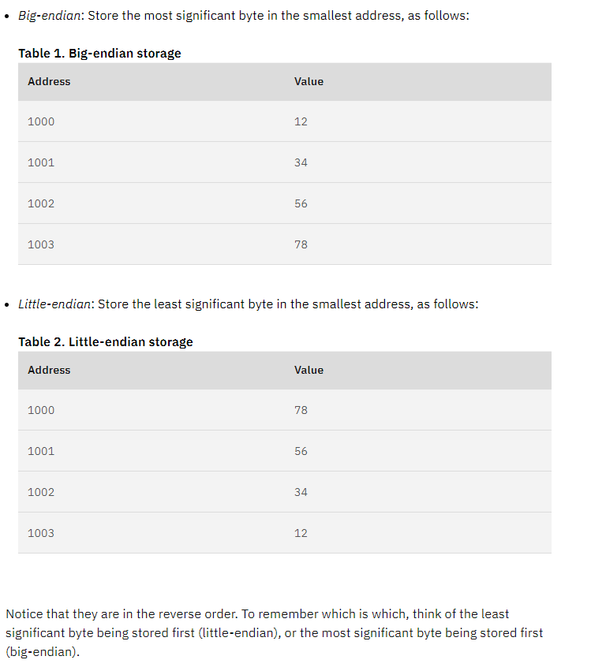

 # theory-algos-project
Repo to calculate the SHA512 value of an input file

   ### Description
   Repository contains a program written in the C programming language to calculate the SHA512 value of an input file. The program takes the name (or path of the file)
   as a command line argument and outputs the SHA512 digest of the file. The program compiles using gcc, please see the next section called Compiliation Instructions for
   further explanation. 
   The following files are included in the repository, SHA512 file, Makefile, test files and this README.

   ### Compilation instructions stating how to compile, test, and run your program.
   
   ### An explanation of what the SHA-512 algorithm is and why it is important.
   Secure Hash Algorithms are a family of cryptographic hash functions published by the National Institute of Standards and Technology(NSIT). 
   These include SHA-2 algorithms, which is a family of two similar hash functions, with different block sizes, kown as SHA-256 and SHA-512. 
   They differ in the word size; SHA-256 uses 32-byte words where SHA-512 uses 64-byte words. These functions were designed by the National Security Agency(NSA).[1]
   This project is using the SHA-512 algorithm as a basis for a program written in C.

   A cryptographic hash function is a mathematical algorithm that maps data (called the "message") to a bit array of a fixed size, called the "hash value", 
   "hash or "message digest". It is a one way function that is practically infeasible to invert. Currently, the only way to find a message that produces a given hash                is to attempt a brute-force search of possible inputs to see if they produce a match.

   Cryptographic hash functions should have the following main properties:

   Deterministic, meaning that the same message always results in the same hash. 
   Quick to compute the hash value for any given message. 
   Infeasible to generate a message that yields a given hash value (i.e. to reverse the process that generated the given hash value). 
   Infeasible to find two different messages with the same hash value. 
   A small change to a message should change the hash value so extensively that a new hash value appears uncorrelated with the old hash value.[2]

   When a message of any length less than 2^64 bits (forSHA-1, SHA-224 and SHA-256) or less than 2^128 bits (for SHA-384, SHA-512, SHA-512/224and SHA-512/256) is
   input to a hash algorithm, the result is an output called a message digest. The message digests range in length from 160 to 512 bits, depending on the algorithm.
   Secure hash algorithms are typically used with other cryptographic algorithms, such as digital signature algorithms and keyed-hash message authentication codes, or 
   in the generation of random numbers (bits).[3]
   
   SHA-512 is more secure than SHA-256 and is commonly faster than SHA-256 on 64-bit machines such as AMD64.[4]

   ### Understanding issues that required attention
   
   
    
   
    
   ### Why can't we reverse the SHA512 algorithm to retrieve the original message from a hash digest?
        
   ### Can you design an algorithm that, given enough time, will find input messages that give each of the possible 512-bit strings?
        
   ### How difficult is it to find a hash digest beginning with at least twelve zeros?

  ## References
  [1] Secure Hash Algorithms; https://en.wikipedia.org/wiki/Secure_Hash_Algorithms
  [2] Cryptographic hash function explantions; https://en.wikipedia.org/wiki/Cryptographic_hash_function
  [3] Secure Hash Standard (SHS); Information Technology Laboratory National Institute of Standards and Technology Gaithersburg, MD 20899-8900
  [4] Security of SHA-512; https://en.wikipedia.org/wiki/Cryptographic_hash_function
  

  ### Research on Topics not fully understood by me
  https://en.wikipedia.org/wiki/Endianness
  https://developer.ibm.com/technologies/systems/articles/au-endianc/

  ### Links for tutorials used in the course of this peoject
  [a] How to write a MakeFile; https://www.cs.colby.edu/maxwell/courses/tutorials/maketutor/

  ### Links for other SHA-512 information
  [i] SHA-512 vs SHA-256 Structure; https://en.wikipedia.org/wiki/SHA-2

  SHA-512 is identical in structure to SHA-256, but:

    the message is broken into 1024-bit chunks,
    the initial hash values and round constants are extended to 64 bits,
    there are 80 rounds instead of 64,
    the message schedule array w has 80 64-bit words instead of 64 32-bit words,
    to extend the message schedule array w, the loop is from 16 to 79 instead of from 16 to 63,
    the round constants are based on the first 80 primes 2..409,
    the word size used for calculations is 64 bits long,
    the appended length of the message (before pre-processing), in bits, is a 128-bit big-endian integer, and
    the shift and rotate amounts used are different[i]

# To Do List
   
  Research http://www.righto.com/2014/09/mining-bitcoin-with-pencil-and-paper.html  
  Research bitcoin - understand what it does and why it's so secure  
  look at open ssl project  
